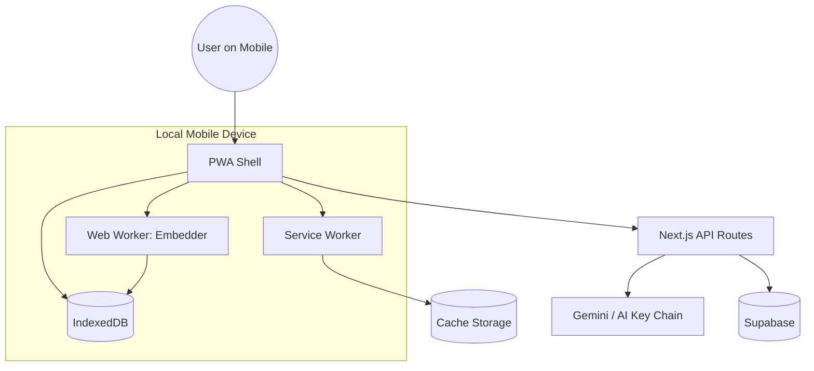

# 22-mobile-architecture.md

# System Architecture for Mobile

## Overview
The DocuLearn mobile architecture is built on the **"Smart Client"** paradigm. Instead of relying on heavy server-side processing, the mobile app leverages local device capabilities (Web Workers, IndexedDB, and Service Workers) to provide a fast, offline-capable learning experience.

---

## 1. PWA Foundation
DocuLearn is architected as a Progressive Web App (PWA) to bridge the gap between web and native mobile experiences.

### Key Components:
- **Manifest (`manifest.json`)**: Configures the app's appearance on the home screen, including icons, theme colors, and display mode (`standalone`).
- **Service Worker (`sw.js`)**:
    - **Caching Strategy**: Stale-While-Revalidate for core assets (JS, CSS, Fonts).
    - **Offline Support**: Intercepts fetch requests to serve the application shell when the network is unavailable.
    - **Background Sync**: (Planned) Queuing Doubt Graph updates to sync with Supabase once back online.

---

## 2. Local Data Management
Mobile devices often have intermittent connectivity. Our architecture prioritizes local-first data storage.

### IndexedDB (Browser Database)
- **Document Storage**: Large PDF blobs are stored locally in IndexedDB to avoid repeated downloads.
- **Embedding Cache**: Vector embeddings for document chunks are stored locally, enabling client-side RAG without server roundtrips.
- **Doubt Graph State**: The entire state of the active learning session is persisted in real-time.

### Device Identification
- Since DocuLearn is "No-Login", we use a persistent `deviceId` (UUID) stored in `localStorage`.
- This ID acts as the primary key for cloud-syncing Doubt Graphs to Supabase via RLS (Row Level Security).

---

## 3. Client-Side AI Processing
To maintain privacy and reduce latency on mobile, heavy processing is offloaded to Web Workers.

- **Background Embedding**: A dedicated Web Worker runs the `all-MiniLM-L6-v2` model using ONNX Runtime.
- **Resource Throttling**: The embedding process is prioritized based on the active page the user is viewing, ensuring the mobile CPU isn't overwhelmed.
- **Memory Management**: Blobs and large arrays are transferred (not copied) between the main thread and workers to prevent memory leaks on mobile browsers.

---

## 4. Mobile Communication Flow

---

## 5. Security & Privacy for Mobile
- **End-to-End Privacy**: No document content is ever stored permanently on our servers unless the user opts into cloud sync.
- **Hardware Security**: Leveraging browser-level encryption for local storage where available.
- **API Protection**: Mobile requests are rate-limited and validated using device-specific signatures (Device ID).

---

## 6. Future Mobile Roadmap
- **Native Push Notifications**: For review reminders based on the memory system.
- **Biometric Lock**: Using the Web Authentication API to lock sensitive document graphs.
- **Enhanced Offline MCQ**: Pre-generating and caching exam questions for complete offline study.
